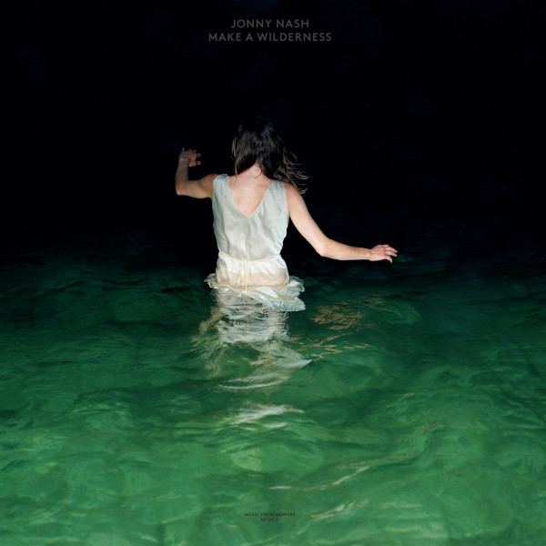
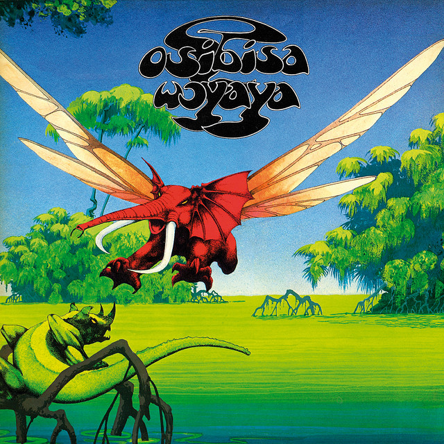
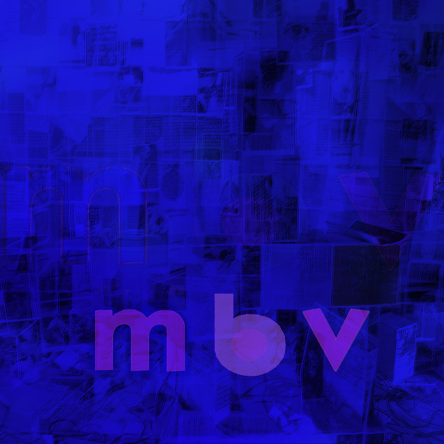
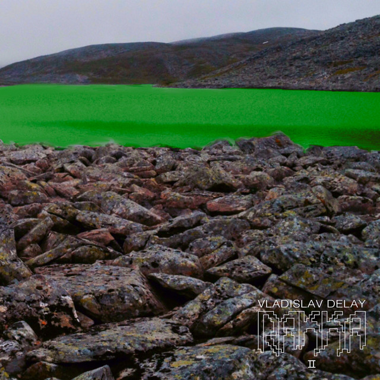
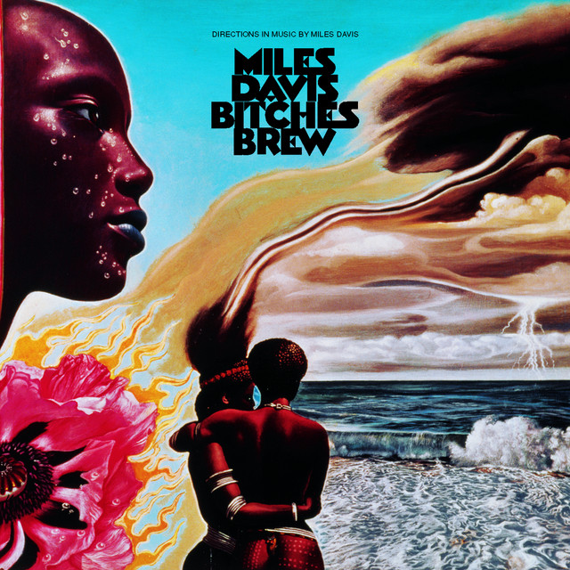
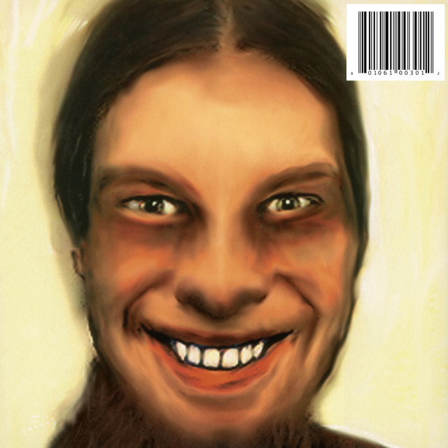
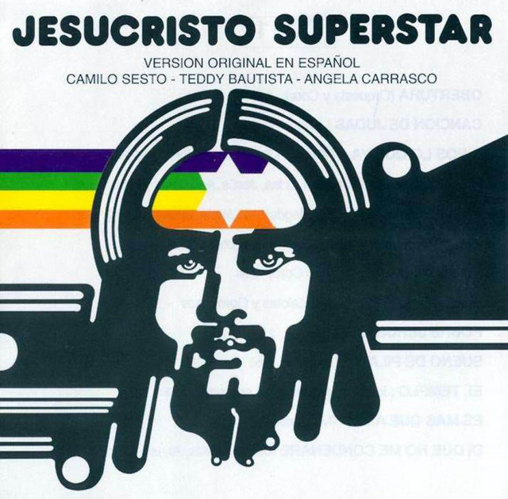
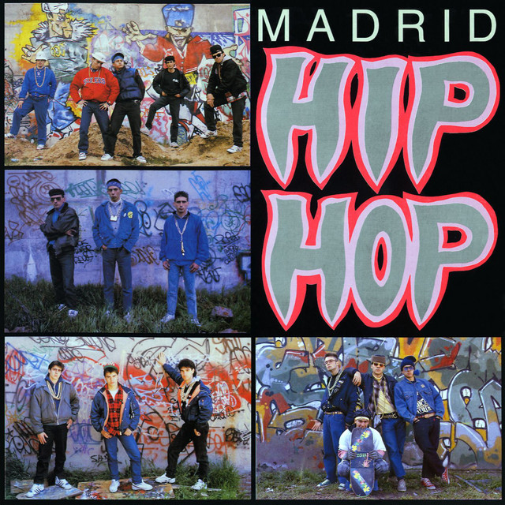
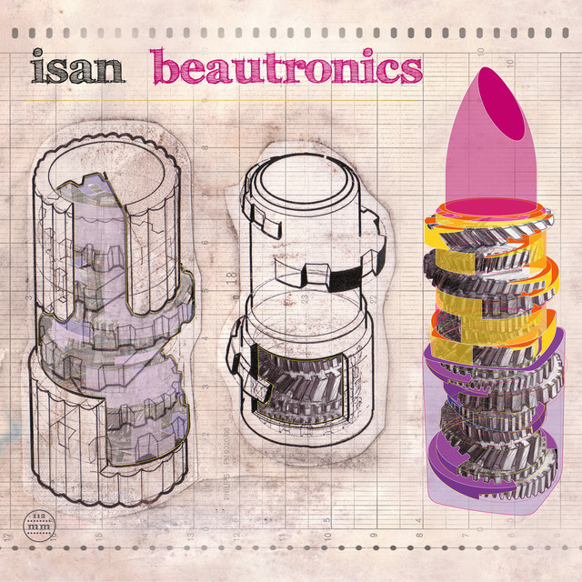

# Mi Colección de Discos

Esta es mi colección personal de discos obtenida desde [Discogs](https://www.discogs.com).

**Última actualización:** 09 de July de 2025 a las 16:14
**Total de álbumes:** 182

---

## Mogwai - The Bad Fire

  

    
  

  

    
<strong>Fecha de Agregado:</strong> 2025-07-02

    
<strong>Año:</strong> 2025

    
<strong>Géneros:</strong> Rock

    
<strong>Estilos:</strong> Post Rock

  

---

## Los Planetas - Una Semana En El Motor De Un Autobús

  

    
  

  

    
<strong>Fecha de Agregado:</strong> 2025-07-02

    
<strong>Año:</strong> 2025

    
<strong>Géneros:</strong> Rock

    
<strong>Estilos:</strong> Alternative Rock, Indie Rock

  

---

## Gabor Szabo - Dreams

  

    
  

  

    
<strong>Fecha de Agregado:</strong> 2025-02-26

    
<strong>Año:</strong> 2020

    
<strong>Géneros:</strong> Jazz

    
<strong>Estilos:</strong> Avant-garde Jazz

  

---

## Fleet Foxes - Crack-Up

  

    
  

  

    
<strong>Fecha de Agregado:</strong> 2024-11-06

    
<strong>Año:</strong> 2017

    
<strong>Géneros:</strong> Rock, Folk, World, & Country

    
<strong>Estilos:</strong> Folk Rock

  

---

## Julee Cruise - Floating Into The Night

  

    
  

  

    
<strong>Fecha de Agregado:</strong> 2024-11-06

    
<strong>Año:</strong> 2015

    
<strong>Géneros:</strong> Electronic, Jazz

    
<strong>Estilos:</strong> Smooth Jazz, Downtempo

  

---

## Gaussian Curve - The Distance

  

    
  

  

    
<strong>Fecha de Agregado:</strong> 2024-11-04

    
<strong>Año:</strong> 2017

    
<strong>Géneros:</strong> Electronic

    
<strong>Estilos:</strong> Ambient

  

---

## Sigur Rós - Átta

  

    
  

  

    
<strong>Fecha de Agregado:</strong> 2024-01-17

    
<strong>Año:</strong> 2023

    
<strong>Géneros:</strong> Rock

    
<strong>Estilos:</strong> Ethereal, Post Rock

  

---

## Mogwai - Young Team

  

    
  

  

    
<strong>Fecha de Agregado:</strong> 2024-01-17

    
<strong>Año:</strong> 2023

    
<strong>Géneros:</strong> Rock

    
<strong>Estilos:</strong> Post Rock

  

---

## Daniel Avery - Ultra Truth

  

    
  

  

    
<strong>Fecha de Agregado:</strong> 2024-01-07

    
<strong>Año:</strong> 2022

    
<strong>Géneros:</strong> Electronic

    
<strong>Estilos:</strong> Leftfield, Techno, IDM, Jungle, Ambient

  

---

## Gaussian Curve - Clouds

  

    
  

  

    
<strong>Fecha de Agregado:</strong> 2024-01-07

    
<strong>Año:</strong> 2016

    
<strong>Géneros:</strong> Electronic

    
<strong>Estilos:</strong> Ambient, Downtempo, New Age

  

---

## Jonny Nash - Point Of Entry

  

    
  

  

    
<strong>Fecha de Agregado:</strong> 2024-01-07

    
<strong>Año:</strong> 2023

    
<strong>Géneros:</strong> Electronic, Jazz

    
<strong>Estilos:</strong> Ambient, Dream Pop, Balearic

  

---

## Tyler, The Creator - Igor

  

    
  

  

    
<strong>Fecha de Agregado:</strong> 2024-01-07

    
<strong>Año:</strong> 2022

    
<strong>Géneros:</strong> Hip Hop, Funk / Soul

    
<strong>Estilos:</strong> Contemporary R&B, Neo Soul

  

---

## Jon Hassell - Listening To Pictures (Pentimento Volume One)

  

    
  

  

    
<strong>Fecha de Agregado:</strong> 2023-11-24

    
<strong>Año:</strong> 2018

    
<strong>Géneros:</strong> Electronic, Jazz

    
<strong>Estilos:</strong> Ambient, Contemporary Jazz, Leftfield

  

---

## Jonny Nash - Make A Wilderness

  

    
  

  

    
<strong>Fecha de Agregado:</strong> 2023-11-17

    
<strong>Año:</strong> 2019

    
<strong>Géneros:</strong> Electronic

    
<strong>Estilos:</strong> Ambient, Experimental

  

---

## Massive Attack - Mezzanine

  

    
  

  

    
<strong>Fecha de Agregado:</strong> 2023-11-10

    
<strong>Año:</strong> 2013

    
<strong>Géneros:</strong> Electronic

    
<strong>Estilos:</strong> Trip Hop, Downtempo

  

---

## My Bloody Valentine - Loveless

  

    
  

  

    
<strong>Fecha de Agregado:</strong> 2023-11-07

    
<strong>Año:</strong> 2021

    
<strong>Géneros:</strong> Rock

    
<strong>Estilos:</strong> Shoegaze, Alternative Rock, Noise Rock

  

---

## The Chemical Brothers - For That Beautiful Feeling

  

    
  

  

    
<strong>Fecha de Agregado:</strong> 2023-10-12

    
<strong>Año:</strong> 2023

    
<strong>Géneros:</strong> Electronic

    
<strong>Estilos:</strong> Electro

  

---

## The Soft Moon - Exister

  

    
  

  

    
<strong>Fecha de Agregado:</strong> 2023-08-26

    
<strong>Año:</strong> 2022

    
<strong>Géneros:</strong> Rock

    
<strong>Estilos:</strong> Industrial, Post-Punk

  

---

## Tangerine Dream - Zeit

  

    
  

  

    
<strong>Fecha de Agregado:</strong> 2023-08-01

    
<strong>Géneros:</strong> Electronic

    
<strong>Estilos:</strong> Berlin-School, Ambient

  

---

## Khruangbin, Leon Bridges - Texas Moon

  

    
  

  

    
<strong>Fecha de Agregado:</strong> 2023-07-27

    
<strong>Año:</strong> 2022

    
<strong>Géneros:</strong> Rock, Funk / Soul

    
<strong>Estilos:</strong> Psychedelic Rock, Soul, Country Rock

  

---

## Lonnie Liston Smith And The Cosmic Echoes - Renaissance

  

    
  

  

    
<strong>Fecha de Agregado:</strong> 2023-07-27

    
<strong>Año:</strong> 2022

    
<strong>Géneros:</strong> Jazz, Funk / Soul

    
<strong>Estilos:</strong> Space-Age, Jazz-Funk

  

---

## Chet Baker - Chet

  

    
  

  

    
<strong>Fecha de Agregado:</strong> 2023-03-14

    
<strong>Año:</strong> 2022

    
<strong>Géneros:</strong> Jazz

    
<strong>Estilos:</strong> Cool Jazz, Hard Bop

  

---

## Chet Baker - Chet Baker Sings

  

    
  

  

    
<strong>Fecha de Agregado:</strong> 2023-03-14

    
<strong>Año:</strong> 2018

    
<strong>Géneros:</strong> Jazz

    
<strong>Estilos:</strong> Bop, Cool Jazz

  

---

## Metro Area - Metro Area

  

    
  

  

    
<strong>Fecha de Agregado:</strong> 2023-03-14

    
<strong>Año:</strong> 2017

    
<strong>Géneros:</strong> Electronic

    
<strong>Estilos:</strong> Deep House, Electro, Nu-Disco

  

---

## LaBelle - Nightbirds

  

    
  

  

    
<strong>Fecha de Agregado:</strong> 2023-02-28

    
<strong>Año:</strong> 1975

    
<strong>Géneros:</strong> Funk / Soul

    
<strong>Estilos:</strong> Funk, Disco, Soul

  

---

## Chaka Khan - Chaka

  

    
  

  

    
<strong>Fecha de Agregado:</strong> 2023-02-28

    
<strong>Año:</strong> 1978

    
<strong>Géneros:</strong> Funk / Soul

    
<strong>Estilos:</strong> Disco

  

---

## Yo La Tengo - This Stupid World

  

    
  

  

    
<strong>Fecha de Agregado:</strong> 2023-02-28

    
<strong>Año:</strong> 2023

    
<strong>Géneros:</strong> Rock, Pop

    
<strong>Estilos:</strong> Alternative Rock, Indie Rock

  

---

## Daft Punk - Random Access Memories

  

    
  

  

    
<strong>Fecha de Agregado:</strong> 2022-12-22

    
<strong>Año:</strong> 2013

    
<strong>Géneros:</strong> Electronic, Funk / Soul, Pop

    
<strong>Estilos:</strong> Disco, Funk, Synth-pop, Electro

  

---

## Todd Terje - It's The Arps EP

  

    
  

  

    
<strong>Fecha de Agregado:</strong> 2022-12-22

    
<strong>Año:</strong> 2013

    
<strong>Géneros:</strong> Electronic

    
<strong>Estilos:</strong> House, Disco, Nu-Disco

  

---

## Panna Cotta - Sunrise LP

  

    
  

  

    
<strong>Fecha de Agregado:</strong> 2022-12-22

    
<strong>Año:</strong> 2022

    
<strong>Géneros:</strong> Electronic

    
<strong>Estilos:</strong> Disco

  

---

## Harold Melvin And The Blue Notes - Black & Blue Featuring: The Love I Lost

  

    
  

  

    
<strong>Fecha de Agregado:</strong> 2022-12-10

    
<strong>Año:</strong> 1974

    
<strong>Géneros:</strong> Funk / Soul

    
<strong>Estilos:</strong> Soul, Disco

  

---

## Donna Summer - Once Upon A Time... / Erase Una Vez...

  

    
  

  

    
<strong>Fecha de Agregado:</strong> 2022-12-03

    
<strong>Año:</strong> 1977

    
<strong>Géneros:</strong> Electronic

    
<strong>Estilos:</strong> Disco

  

---

## Hi-Gloss - Hi-Gloss

  

    
  

  

    
<strong>Fecha de Agregado:</strong> 2022-12-03

    
<strong>Año:</strong> 1982

    
<strong>Géneros:</strong> Electronic, Funk / Soul

    
<strong>Estilos:</strong> Disco

  

---

## Osibisa - Woyaya

  

    
  

  

    
<strong>Fecha de Agregado:</strong> 2022-12-03

    
<strong>Año:</strong> 1971

    
<strong>Géneros:</strong> Rock, Latin, Funk / Soul, Folk, World, & Country

    
<strong>Estilos:</strong> Afrobeat, African, Funk

  

---

## Nils Frahm - All Melody

  

    
  

  

    
<strong>Fecha de Agregado:</strong> 2022-12-03

    
<strong>Año:</strong> 2018

    
<strong>Géneros:</strong> Electronic

    
<strong>Estilos:</strong> Modern Classical, Abstract

  

---

## Bardo Pond - Amanita

  

    
  

  

    
<strong>Fecha de Agregado:</strong> 2022-12-03

    
<strong>Año:</strong> 2021

    
<strong>Géneros:</strong> Rock

    
<strong>Estilos:</strong> Psychedelic Rock, Shoegaze

  

---

## Pink Floyd - The Dark Side Of The Moon

  

    
  

  

    
<strong>Fecha de Agregado:</strong> 2022-12-03

    
<strong>Año:</strong> 2016

    
<strong>Géneros:</strong> Rock

    
<strong>Estilos:</strong> Prog Rock, Psychedelic Rock, Classic Rock

  

---

## The Vendetta Suite - The Kempe Stone Portal

  

    
  

  

    
<strong>Fecha de Agregado:</strong> 2022-09-13

    
<strong>Año:</strong> 2021

    
<strong>Géneros:</strong> Electronic

    
<strong>Estilos:</strong> Ambient, Acid House, Dub, New Wave, Synth-pop, Lento Violento, Downtempo, New Age

  

---

## Various - Buena Onda - Balearic Beats 2021 / Sampler Uno

  

    
  

  

    
<strong>Fecha de Agregado:</strong> 2022-09-13

    
<strong>Año:</strong> 2021

    
<strong>Géneros:</strong> Electronic

    
<strong>Estilos:</strong> Balearic, Downtempo, Nu-Disco, Deep House

  

---

## Various - Buena Onda Balearic Beats Vinyl Sampler Due

  

    
  

  

    
<strong>Fecha de Agregado:</strong> 2022-09-13

    
<strong>Año:</strong> 2021

    
<strong>Géneros:</strong> Electronic

    
<strong>Estilos:</strong> Disco, Downtempo, Abstract, Deep House

  

---

## Calm - Before - いままでのむこうがわ - = Up Until Now

  

    
  

  

    
<strong>Fecha de Agregado:</strong> 2022-09-13

    
<strong>Año:</strong> 2022

    
<strong>Géneros:</strong> Electronic, Jazz

    
<strong>Estilos:</strong> Downtempo

  

---

## Yan Cook - XXX LP

  

    
  

  

    
<strong>Fecha de Agregado:</strong> 2022-07-24

    
<strong>Año:</strong> 2022

    
<strong>Géneros:</strong> Electronic

    
<strong>Estilos:</strong> Techno

  

---

## Sciahri - Seyl

  

    
  

  

    
<strong>Fecha de Agregado:</strong> 2022-07-24

    
<strong>Año:</strong> 2021

    
<strong>Géneros:</strong> Electronic

    
<strong>Estilos:</strong> Techno

  

---

## Sciahri, Desroi - In Mirrors

  

    
  

  

    
<strong>Fecha de Agregado:</strong> 2022-07-24

    
<strong>Año:</strong> 2022

    
<strong>Géneros:</strong> Electronic

    
<strong>Estilos:</strong> Techno

  

---

## Luigi Tozzi - Tender Is The Night

  

    
  

  

    
<strong>Fecha de Agregado:</strong> 2022-07-24

    
<strong>Año:</strong> 2019

    
<strong>Géneros:</strong> Electronic

    
<strong>Estilos:</strong> Techno, Deep Techno

  

---

## Klaus Schulze - Timewind

  

    
  

  

    
<strong>Fecha de Agregado:</strong> 2022-07-24

    
<strong>Año:</strong> 1978

    
<strong>Géneros:</strong> Electronic

    
<strong>Estilos:</strong> Ambient

  

---

## Vangelis - Themes

  

    
  

  

    
<strong>Fecha de Agregado:</strong> 2022-07-24

    
<strong>Año:</strong> 1989

    
<strong>Géneros:</strong> Electronic, Stage & Screen

    
<strong>Estilos:</strong> Modern Classical, Theme, Ambient

  

---

## Donna Summer - Bad Girls

  

    
  

  

    
<strong>Fecha de Agregado:</strong> 2022-07-24

    
<strong>Año:</strong> 1979

    
<strong>Géneros:</strong> Funk / Soul

    
<strong>Estilos:</strong> Disco

  

---

## Tangerine Dream - Stratosfear

  

    
  

  

    
<strong>Fecha de Agregado:</strong> 2022-07-24

    
<strong>Año:</strong> 1980

    
<strong>Géneros:</strong> Electronic, Rock

    
<strong>Estilos:</strong> Alternative Rock, Ambient

  

---

## My Bloody Valentine - m b v

  

    
  

  

    
<strong>Fecha de Agregado:</strong> 2022-07-24

    
<strong>Año:</strong> 2021

    
<strong>Géneros:</strong> Rock

    
<strong>Estilos:</strong> Shoegaze

  

---

## The Doors - The Doors

  

    
  

  

    
<strong>Fecha de Agregado:</strong> 2022-07-01

    
<strong>Año:</strong> 2009

    
<strong>Géneros:</strong> Rock

    
<strong>Estilos:</strong> Psychedelic Rock, Blues Rock

  

---

## Central Line - Breaking Point

  

    
  

  

    
<strong>Fecha de Agregado:</strong> 2022-05-18

    
<strong>Año:</strong> 1981

    
<strong>Géneros:</strong> Electronic, Funk / Soul

    
<strong>Estilos:</strong> Disco

  

---

## The Cure - Disintegration

  

    
  

  

    
<strong>Fecha de Agregado:</strong> 2022-05-18

    
<strong>Año:</strong> 2010

    
<strong>Géneros:</strong> Rock

    
<strong>Estilos:</strong> Alternative Rock, New Wave

  

---

## Lanowa - Seven Seas

  

    
  

  

    
<strong>Fecha de Agregado:</strong> 2022-04-02

    
<strong>Año:</strong> 2020

    
<strong>Géneros:</strong> Electronic

    
<strong>Estilos:</strong> Nu-Disco

  

---

## Vladislav Delay - Rakka

  

    
  

  

    
<strong>Fecha de Agregado:</strong> 2022-03-18

    
<strong>Año:</strong> 2020

    
<strong>Géneros:</strong> Electronic

    
<strong>Estilos:</strong> Abstract, Techno, Ambient, Experimental, Rhythmic Noise

  

---

## Weather Report - Black Market

  

    
  

  

    
<strong>Fecha de Agregado:</strong> 2022-03-18

    
<strong>Año:</strong> 2011

    
<strong>Géneros:</strong> Jazz

    
<strong>Estilos:</strong> Fusion

  

---

## Jon Hassell, Farafina - Flash Of The Spirit

  

    
  

  

    
<strong>Fecha de Agregado:</strong> 2022-03-18

    
<strong>Año:</strong> 2020

    
<strong>Géneros:</strong> Electronic, Folk, World, & Country

    
<strong>Estilos:</strong> Tribal, Ambient, Experimental, African

  

---

## Various - La Ola Interior (Spanish Ambient & Acid Exoticism 1983-1990)

  

    
  

  

    
<strong>Fecha de Agregado:</strong> 2022-03-18

    
<strong>Año:</strong> 2021

    
<strong>Géneros:</strong> Electronic

    
<strong>Estilos:</strong> Ambient

  

---

## Suso Sáiz - Nothing Is Objective

  

    
  

  

    
<strong>Fecha de Agregado:</strong> 2022-03-18

    
<strong>Año:</strong> 2019

    
<strong>Géneros:</strong> Electronic

    
<strong>Estilos:</strong> Experimental, Ambient

  

---

## Island People - II

  

    
  

  

    
<strong>Fecha de Agregado:</strong> 2022-02-11

    
<strong>Año:</strong> 2021

    
<strong>Géneros:</strong> Electronic

    
<strong>Estilos:</strong> Ambient, Experimental

  

---

## Alva Noto - Xerrox Vol.4

  

    
  

  

    
<strong>Fecha de Agregado:</strong> 2022-01-13

    
<strong>Año:</strong> 2020

    
<strong>Géneros:</strong> Electronic

    
<strong>Estilos:</strong> Ambient, Experimental

  

---

## Fennesz - Agora

  

    
  

  

    
<strong>Fecha de Agregado:</strong> 2022-01-13

    
<strong>Año:</strong> 2019

    
<strong>Géneros:</strong> Electronic

    
<strong>Estilos:</strong> Ambient, Experimental

  

---

## Floating Points, Pharoah Sanders, London Symphony Orchestra - Promises

  

    
  

  

    
<strong>Fecha de Agregado:</strong> 2022-01-06

    
<strong>Año:</strong> 2021

    
<strong>Géneros:</strong> Electronic, Jazz

    
<strong>Estilos:</strong> Soul-Jazz, Modal

  

---

## Miles Davis - Live-Evil

  

    
  

  

    
<strong>Fecha de Agregado:</strong> 2022-01-06

    
<strong>Año:</strong> 2021

    
<strong>Géneros:</strong> Jazz

    
<strong>Estilos:</strong> Fusion

  

---

## Amulets - Blooming

  

    
  

  

    
<strong>Fecha de Agregado:</strong> 2021-08-15

    
<strong>Año:</strong> 2021

    
<strong>Géneros:</strong> Electronic, Rock

    
<strong>Estilos:</strong> Ambient, Drone, Experimental

  

---

## Island People - Island People

  

    
  

  

    
<strong>Fecha de Agregado:</strong> 2021-08-15

    
<strong>Año:</strong> 2017

    
<strong>Géneros:</strong> Electronic

    
<strong>Estilos:</strong> Ambient

  

---

## Hollie Kenniff - The Quiet Drift 

  

    
  

  

    
<strong>Fecha de Agregado:</strong> 2021-08-15

    
<strong>Año:</strong> 2021

    
<strong>Géneros:</strong> Electronic

    
<strong>Estilos:</strong> Ambient, Experimental

  

---

## Various - Virtual Dreams (Ambient Explorations In The House & Techno Age, 1993-1997)

  

    
  

  

    
<strong>Fecha de Agregado:</strong> 2021-08-07

    
<strong>Año:</strong> 2020

    
<strong>Géneros:</strong> Electronic

    
<strong>Estilos:</strong> Ambient, Techno, Downtempo, IDM, Acid

  

---

## Bebo Valdés, Diego "El Cigala" - Lágrimas Negras

  

    
  

  

    
<strong>Fecha de Agregado:</strong> 2021-07-29

    
<strong>Año:</strong> 2021

    
<strong>Géneros:</strong> Latin, Folk, World, & Country

    
<strong>Estilos:</strong> Flamenco, Bolero

  

---

## El Camarón De La Isla - La Leyenda Del Tiempo

  

    
  

  

    
<strong>Fecha de Agregado:</strong> 2021-07-29

    
<strong>Año:</strong> 2019

    
<strong>Géneros:</strong> Rock, Latin

    
<strong>Estilos:</strong> Flamenco, Prog Rock

  

---

## Nine Inch Nails - Add Violence

  

    
  

  

    
<strong>Fecha de Agregado:</strong> 2021-07-29

    
<strong>Año:</strong> 2017

    
<strong>Géneros:</strong> Electronic

    
<strong>Estilos:</strong> Industrial

  

---

## Depeche Mode - Songs Of Faith And Devotion

  

    
  

  

    
<strong>Fecha de Agregado:</strong> 2021-07-29

    
<strong>Géneros:</strong> Electronic, Rock

    
<strong>Estilos:</strong> Alternative Rock, Synth-pop

  

---

## Donny Hathaway - Live

  

    
  

  

    
<strong>Fecha de Agregado:</strong> 2021-07-29

    
<strong>Año:</strong> 2021

    
<strong>Géneros:</strong> Funk / Soul

    
<strong>Estilos:</strong> Soul, Funk, Vocal

  

---

## Khruangbin - The Universe Smiles Upon You

  

    
  

  

    
<strong>Fecha de Agregado:</strong> 2021-06-04

    
<strong>Año:</strong> 2020

    
<strong>Géneros:</strong> Jazz, Rock, Funk / Soul

  

---

## Miles Davis - Bitches Brew

  

    
  

  

    
<strong>Fecha de Agregado:</strong> 2021-06-04

    
<strong>Año:</strong> 2016

    
<strong>Géneros:</strong> Jazz

    
<strong>Estilos:</strong> Fusion

  

---

## Roy Davis Jr., Peven Everett - Gabriel

  

    
  

  

    
<strong>Fecha de Agregado:</strong> 2021-06-04

    
<strong>Año:</strong> 2020

    
<strong>Géneros:</strong> Electronic

    
<strong>Estilos:</strong> House, Garage House

  

---

## Manuel Göttsching - E2–E4

  

    
  

  

    
<strong>Fecha de Agregado:</strong> 2021-06-04

    
<strong>Año:</strong> 2016

    
<strong>Géneros:</strong> Electronic

    
<strong>Estilos:</strong> Minimal, Ambient

  

---

## Lafayette Street - Chariot (I Will Follow Him) / Colorado Creek

  

    
  

  

    
<strong>Fecha de Agregado:</strong> 2021-06-04

    
<strong>Año:</strong> 1976

    
<strong>Géneros:</strong> Electronic, Funk / Soul

    
<strong>Estilos:</strong> Disco

  

---

## Change - Miracles

  

    
  

  

    
<strong>Fecha de Agregado:</strong> 2021-06-04

    
<strong>Año:</strong> 1981

    
<strong>Géneros:</strong> Funk / Soul

    
<strong>Estilos:</strong> Disco

  

---

## Love Unlimited Orchestra - Music Maestro Please

  

    
  

  

    
<strong>Fecha de Agregado:</strong> 2021-06-04

    
<strong>Año:</strong> 1975

    
<strong>Géneros:</strong> Funk / Soul

    
<strong>Estilos:</strong> Soul, Disco

  

---

## Jean-Luc Ponty - Mystical Adventures

  

    
  

  

    
<strong>Fecha de Agregado:</strong> 2021-06-04

    
<strong>Año:</strong> 1982

    
<strong>Géneros:</strong> Jazz

    
<strong>Estilos:</strong> Fusion

  

---

## Donna Summer - A Love Trilogy

  

    
  

  

    
<strong>Fecha de Agregado:</strong> 2021-06-04

    
<strong>Año:</strong> 1976

    
<strong>Géneros:</strong> Electronic

    
<strong>Estilos:</strong> Disco

  

---

## Yussef Kamaal - Black Focus

  

    
  

  

    
<strong>Fecha de Agregado:</strong> 2021-06-04

    
<strong>Año:</strong> 2017

    
<strong>Géneros:</strong> Electronic, Jazz

    
<strong>Estilos:</strong> Contemporary Jazz, Soul-Jazz, Broken Beat, Deep House

  

---

## The Zenmenn - Enter The Zenmenn

  

    
  

  

    
<strong>Fecha de Agregado:</strong> 2021-06-04

    
<strong>Año:</strong> 2021

    
<strong>Géneros:</strong> Electronic, Pop, Folk, World, & Country

    
<strong>Estilos:</strong> Ambient, Indie Pop

  

---

## Perc - Fire In Negative

  

    
  

  

    
<strong>Fecha de Agregado:</strong> 2021-05-12

    
<strong>Año:</strong> 2021

    
<strong>Géneros:</strong> Electronic

    
<strong>Estilos:</strong> Techno

  

---

## Mike Dehnert - Framework

  

    
  

  

    
<strong>Fecha de Agregado:</strong> 2021-05-12

    
<strong>Año:</strong> 2011

    
<strong>Géneros:</strong> Electronic

    
<strong>Estilos:</strong> Techno

  

---

## Derby Motoreta's Burrito Kachimba - Hilo Negro

  

    
  

  

    
<strong>Fecha de Agregado:</strong> 2021-05-12

    
<strong>Año:</strong> 2021

    
<strong>Géneros:</strong> Rock

    
<strong>Estilos:</strong> Psychedelic Rock

  

---

## Mogwai - As The Love Continues 

  

    
  

  

    
<strong>Fecha de Agregado:</strong> 2021-05-12

    
<strong>Año:</strong> 2021

    
<strong>Géneros:</strong> Rock

    
<strong>Estilos:</strong> Post Rock

  

---

## Womack & Womack - Teardrops

  

    
  

  

    
<strong>Fecha de Agregado:</strong> 2021-05-12

    
<strong>Año:</strong> 1988

    
<strong>Géneros:</strong> Funk / Soul

  

---

## Various - Stranger Things (Music From The Netflix Original Series)

  

    
  

  

    
<strong>Fecha de Agregado:</strong> 2021-03-31

    
<strong>Año:</strong> 2018

    
<strong>Géneros:</strong> Rock, Pop, Stage & Screen

    
<strong>Estilos:</strong> Soundtrack

  

---

## Acid Coco - Mucho Gusto

  

    
  

  

    
<strong>Fecha de Agregado:</strong> 2021-03-19

    
<strong>Año:</strong> 2020

    
<strong>Géneros:</strong> Latin, Pop, Folk, World, & Country

    
<strong>Estilos:</strong> Champeta, Merengue, Cumbia, Reggaeton, Son Montuno, Guajira

  

---

## Zebra Katz - Less Is Moor

  

    
  

  

    
<strong>Fecha de Agregado:</strong> 2021-03-19

    
<strong>Año:</strong> 2020

    
<strong>Géneros:</strong> Electronic, Hip Hop

    
<strong>Estilos:</strong> Experimental, Industrial, Glitch Hop, Trap, Hip-House

  

---

## Emmanuel (8) - Stamina

  

    
  

  

    
<strong>Fecha de Agregado:</strong> 2021-03-19

    
<strong>Año:</strong> 2019

    
<strong>Géneros:</strong> Electronic

    
<strong>Estilos:</strong> Techno

  

---

## MRD - Superwoman 2​.​0

  

    
  

  

    
<strong>Fecha de Agregado:</strong> 2021-03-19

    
<strong>Año:</strong> 2020

    
<strong>Géneros:</strong> Electronic

    
<strong>Estilos:</strong> Techno

  

---

## Emmanuel (8) - Emmanuel Present Stealth

  

    
  

  

    
<strong>Fecha de Agregado:</strong> 2021-03-19

    
<strong>Año:</strong> 2020

    
<strong>Géneros:</strong> Electronic

    
<strong>Estilos:</strong> Techno

  

---

## Tim Tama - Wave Of Nostalgia EP 

  

    
  

  

    
<strong>Fecha de Agregado:</strong> 2021-03-19

    
<strong>Año:</strong> 2020

    
<strong>Géneros:</strong> Electronic

    
<strong>Estilos:</strong> Techno

  

---

## Special Touch (3) - Garden Of Life

  

    
  

  

    
<strong>Fecha de Agregado:</strong> 2021-03-19

    
<strong>Año:</strong> 2020

    
<strong>Géneros:</strong> Electronic, Funk / Soul

    
<strong>Estilos:</strong> UK Street Soul, Deep House, House, Soul

  

---

## Max Essa - Black Market Laundrette ​/ ​The Cowboy Rembrandt Remixed

  

    
  

  

    
<strong>Fecha de Agregado:</strong> 2021-03-19

    
<strong>Año:</strong> 2021

    
<strong>Géneros:</strong> Electronic

    
<strong>Estilos:</strong> Downtempo, Deep House

  

---

## Ethimm - By Night EP

  

    
  

  

    
<strong>Fecha de Agregado:</strong> 2021-03-19

    
<strong>Año:</strong> 2020

    
<strong>Géneros:</strong> Electronic

    
<strong>Estilos:</strong> House, Downtempo, Dub

  

---

## Tangerine Dream - Phaedra

  

    
  

  

    
<strong>Fecha de Agregado:</strong> 2021-01-10

    
<strong>Año:</strong> 2020

    
<strong>Géneros:</strong> Electronic

    
<strong>Estilos:</strong> Berlin-School

  

---

## Antonio Carlos Jobim - The Composer Of Desafinado, Plays

  

    
  

  

    
<strong>Fecha de Agregado:</strong> 2021-01-10

    
<strong>Año:</strong> 2019

    
<strong>Géneros:</strong> Jazz

    
<strong>Estilos:</strong> Bossa Nova

  

---

## Jon Hassell - Seeing Through Sound (Pentimento Volume Two)

  

    
  

  

    
<strong>Fecha de Agregado:</strong> 2021-01-10

    
<strong>Año:</strong> 2020

    
<strong>Géneros:</strong> Electronic, Jazz

    
<strong>Estilos:</strong> Ambient, Contemporary Jazz, Leftfield

  

---

## Triana (2) - Hijos Del Agobio

  

    
  

  

    
<strong>Fecha de Agregado:</strong> 2021-01-10

    
<strong>Año:</strong> 2014

    
<strong>Géneros:</strong> Rock

    
<strong>Estilos:</strong> Psychedelic Rock, Prog Rock

  

---

## John Coltrane - Both Directions At Once: The Lost Album

  

    
  

  

    
<strong>Fecha de Agregado:</strong> 2021-01-10

    
<strong>Año:</strong> 2018

    
<strong>Géneros:</strong> Jazz

    
<strong>Estilos:</strong> Post Bop

  

---

## Various - Color De Trópico

  

    
  

  

    
<strong>Fecha de Agregado:</strong> 2020-12-14

    
<strong>Año:</strong> 2020

    
<strong>Géneros:</strong> Jazz, Rock, Latin, Funk / Soul, Pop, Folk, World, & Country

    
<strong>Estilos:</strong> Cumbia, Salsa

  

---

## Etienne De La Sayette - Kobugi

  

    
  

  

    
<strong>Fecha de Agregado:</strong> 2020-12-14

    
<strong>Año:</strong> 2020

    
<strong>Géneros:</strong> Jazz

  

---

## Santana - Abraxas

  

    
  

  

    
<strong>Fecha de Agregado:</strong> 2020-12-14

    
<strong>Año:</strong> 2016

    
<strong>Géneros:</strong> Jazz, Rock, Latin, Funk / Soul

    
<strong>Estilos:</strong> Blues Rock, Psychedelic Rock, Fusion, Jazz-Funk

  

---

## Derby Motoreta's Burrito Kachimba - Derby Motoreta's Burrito Kachimba

  

    
  

  

    
<strong>Fecha de Agregado:</strong> 2020-12-14

    
<strong>Año:</strong> 2019

    
<strong>Géneros:</strong> Rock

    
<strong>Estilos:</strong> Hard Rock, Prog Rock, Psychedelic Rock

  

---

## Diskret (2) - Diskret

  

    
  

  

    
<strong>Fecha de Agregado:</strong> 2020-12-14

    
<strong>Año:</strong> 2019

    
<strong>Géneros:</strong> Electronic

    
<strong>Estilos:</strong> Ambient

  

---

## Mirlaqi - Beyond the Sea of Sand

  

    
  

  

    
<strong>Fecha de Agregado:</strong> 2020-12-14

    
<strong>Año:</strong> 2020

    
<strong>Géneros:</strong> Electronic

    
<strong>Estilos:</strong> House, Dub

  

---

## Dos Santos Anti-Beat Orquesta - Logos

  

    
  

  

    
<strong>Fecha de Agregado:</strong> 2020-12-14

    
<strong>Año:</strong> 2018

    
<strong>Géneros:</strong> Jazz, Latin

  

---

## Aquiles Navarro, Tcheser Holmes - Heritage Of The Invisible II

  

    
  

  

    
<strong>Fecha de Agregado:</strong> 2020-12-14

    
<strong>Año:</strong> 2020

    
<strong>Géneros:</strong> Jazz

    
<strong>Estilos:</strong> Free Jazz, Latin Jazz

  

---

## Platero Y Tu - 7

  

    
  

  

    
<strong>Fecha de Agregado:</strong> 2020-10-23

    
<strong>Géneros:</strong> Rock

    
<strong>Estilos:</strong> Rock & Roll

  

---

## Metallica - St. Anger

  

    
  

  

    
<strong>Fecha de Agregado:</strong> 2020-10-23

    
<strong>Géneros:</strong> Rock

    
<strong>Estilos:</strong> Thrash, Hard Rock, Heavy Metal

  

---

## Kenny G (2) - Miracles - The Holiday Album

  

    
  

  

    
<strong>Fecha de Agregado:</strong> 2020-10-23

    
<strong>Año:</strong> 1994

    
<strong>Géneros:</strong> Jazz

    
<strong>Estilos:</strong> Contemporary Jazz, Easy Listening, Smooth Jazz, Holiday

  

---

## Berliner Philharmoniker, Herbert von Karajan - Adagio

  

    
  

  

    
<strong>Fecha de Agregado:</strong> 2020-10-23

    
<strong>Año:</strong> 1995

    
<strong>Géneros:</strong> Classical

    
<strong>Estilos:</strong> Baroque, Classical, Romantic

  

---

## Ismael Serrano - Principio De Incertidumbre

  

    
  

  

    
<strong>Fecha de Agregado:</strong> 2020-10-23

    
<strong>Año:</strong> 2003

    
<strong>Géneros:</strong> Rock

    
<strong>Estilos:</strong> Acoustic, Soft Rock

  

---

## Juan Luis Guerra 4.40 - Fogaraté!

  

    
  

  

    
<strong>Fecha de Agregado:</strong> 2020-10-23

    
<strong>Año:</strong> 1994

    
<strong>Géneros:</strong> Latin, Pop

    
<strong>Estilos:</strong> Bachata, Merengue, Salsa

  

---

## El Payo Malo - Con Tierra En Los Bolsillos

  

    
  

  

    
<strong>Fecha de Agregado:</strong> 2020-10-23

    
<strong>Año:</strong> 2001

    
<strong>Géneros:</strong> Hip Hop

    
<strong>Estilos:</strong> Conscious, Boom Bap

  

---

## Nino Bravo - 50 Aniversario

  

    
  

  

    
<strong>Fecha de Agregado:</strong> 2020-10-23

    
<strong>Año:</strong> 1995

    
<strong>Géneros:</strong> Latin, Pop

    
<strong>Estilos:</strong> Ballad

  

---

## Marea - Besos De Perro

  

    
  

  

    
<strong>Fecha de Agregado:</strong> 2020-10-23

    
<strong>Año:</strong> 2002

    
<strong>Géneros:</strong> Rock

    
<strong>Estilos:</strong> Alternative Rock, Pop Rock, Indie Rock

  

---

## Luz Casal - Pequeños, Medianos Y Grandes Éxitos

  

    
  

  

    
<strong>Fecha de Agregado:</strong> 2020-10-23

    
<strong>Año:</strong> 2005

    
<strong>Géneros:</strong> Rock

    
<strong>Estilos:</strong> Soft Rock, Pop Rock

  

---

## Herbert von Karajan - Romance

  

    
  

  

    
<strong>Fecha de Agregado:</strong> 2020-10-23

    
<strong>Año:</strong> 1996

    
<strong>Géneros:</strong> Classical

    
<strong>Estilos:</strong> Romantic

  

---

## Carpenters - Voice Of The Heart

  

    
  

  

    
<strong>Fecha de Agregado:</strong> 2020-10-23

    
<strong>Año:</strong> 2009

    
<strong>Géneros:</strong> Pop

    
<strong>Estilos:</strong> Vocal

  

---

## Aphex Twin - Selected Ambient Works 85-92

  

    
  

  

    
<strong>Fecha de Agregado:</strong> 2019-11-11

    
<strong>Año:</strong> 2000

    
<strong>Géneros:</strong> Electronic

    
<strong>Estilos:</strong> Techno, IDM, Ambient

  

---

## Aphex Twin - ...I Care Because You Do

  

    
  

  

    
<strong>Fecha de Agregado:</strong> 2019-11-11

    
<strong>Año:</strong> 1995

    
<strong>Géneros:</strong> Electronic

    
<strong>Estilos:</strong> IDM, Techno

  

---

## Miles Davis - Tutu

  

    
  

  

    
<strong>Fecha de Agregado:</strong> 2019-11-11

    
<strong>Año:</strong> 2015

    
<strong>Géneros:</strong> Jazz, Funk / Soul

    
<strong>Estilos:</strong> Smooth Jazz, Contemporary R&B, Fusion, Jazz-Funk

  

---

## Nuestro Pequeño Mundo - Uno X Uno

  

    
  

  

    
<strong>Fecha de Agregado:</strong> 2019-08-04

    
<strong>Año:</strong> 1970

    
<strong>Géneros:</strong> Rock

    
<strong>Estilos:</strong> Folk Rock

  

---

## Miguel Bosé - Bandido

  

    
  

  

    
<strong>Fecha de Agregado:</strong> 2019-08-04

    
<strong>Año:</strong> 1984

    
<strong>Géneros:</strong> Electronic

    
<strong>Estilos:</strong> Synth-pop

  

---

## Los Chincanayros - Tajaraste

  

    
  

  

    
<strong>Fecha de Agregado:</strong> 2019-08-04

    
<strong>Año:</strong> 1977

    
<strong>Géneros:</strong> Folk, World, & Country

    
<strong>Estilos:</strong> Folk

  

---

## Francis Lai - Love Story = Historia De Amor (Banda Sonora Original De La Pelicula Paramount)

  

    
  

  

    
<strong>Fecha de Agregado:</strong> 2019-08-04

    
<strong>Año:</strong> 1971

    
<strong>Géneros:</strong> Jazz, Stage & Screen

    
<strong>Estilos:</strong> Soundtrack, Easy Listening

  

---

## Erich Sendel - Órgano Y Ritmo

  

    
  

  

    
<strong>Fecha de Agregado:</strong> 2019-08-04

    
<strong>Año:</strong> 1969

    
<strong>Géneros:</strong> Jazz, Latin

    
<strong>Estilos:</strong> Samba, Beguine, Cha-Cha, Mambo

  

---

## Crosby, Stills & Nash - Suite: Judy, Ojos Azules / Pasara Mucho Tiempo

  

    
  

  

    
<strong>Fecha de Agregado:</strong> 2019-08-04

    
<strong>Año:</strong> 1969

    
<strong>Géneros:</strong> Rock

    
<strong>Estilos:</strong> Folk Rock

  

---

## Jeanette (6) - Palabras, Promesas... / Debajo Del Platanero

  

    
  

  

    
<strong>Fecha de Agregado:</strong> 2019-08-04

    
<strong>Año:</strong> 1973

    
<strong>Géneros:</strong> Reggae, Pop

    
<strong>Estilos:</strong> Calypso, Ballad, Vocal

  

---

## Cornelius Brothers & Sister Rose - Demasiado Tarde Para Dar Marcha Atrás / Trátala Como A Una Dama

  

    
  

  

    
<strong>Fecha de Agregado:</strong> 2019-08-04

    
<strong>Año:</strong> 1972

    
<strong>Géneros:</strong> Funk / Soul

    
<strong>Estilos:</strong> Soul

  

---

## Sérgio Mendes & Brasil '77 - Tanta Gente / Pais Tropical

  

    
  

  

    
<strong>Fecha de Agregado:</strong> 2019-08-04

    
<strong>Año:</strong> 1971

    
<strong>Géneros:</strong> Jazz

    
<strong>Estilos:</strong> Easy Listening, Latin Jazz

  

---

## Johnny Rivers - El Septimo Hijo / Susie Q

  

    
  

  

    
<strong>Fecha de Agregado:</strong> 2019-08-04

    
<strong>Año:</strong> 1970

    
<strong>Géneros:</strong> Rock, Pop

    
<strong>Estilos:</strong> Folk Rock, Classic Rock

  

---

## Dolly Parton - 9 To 5 

  

    
  

  

    
<strong>Fecha de Agregado:</strong> 2019-08-04

    
<strong>Año:</strong> 1980

    
<strong>Géneros:</strong> Rock, Pop, Stage & Screen

    
<strong>Estilos:</strong> Theme, Pop Rock

  

---

## The Plastic Ono Band - Cold Turkey / Don't Worry Kyoko (Mummy's Only Looking For A Hand In The Snow)

  

    
  

  

    
<strong>Fecha de Agregado:</strong> 2019-07-22

    
<strong>Año:</strong> 1969

    
<strong>Géneros:</strong> Rock

    
<strong>Estilos:</strong> Pop Rock, Avantgarde

  

---

## Georg Friedrich Händel, The Choir Of Westminster Abbey, The English Concert, Trevor Pinnock, Simon Preston - Coronation Anthems

  

    
  

  

    
<strong>Fecha de Agregado:</strong> 2019-07-22

    
<strong>Año:</strong> 1983

    
<strong>Géneros:</strong> Classical

    
<strong>Estilos:</strong> Baroque

  

---

## Johann Georg Pisendel, Johann Sebastian Bach, Johann Gottlieb Graun, Wolfgang Amadeus Mozart - Violine Des Barock Und Der Klassik

  

    
  

  

    
<strong>Fecha de Agregado:</strong> 2019-07-22

    
<strong>Año:</strong> 1990

    
<strong>Géneros:</strong> Classical

    
<strong>Estilos:</strong> Baroque, Classical

  

---

## Joseph Haydn, Herbert von Karajan - Chöre Und Arien Aus "Die Schöpfung"

  

    
  

  

    
<strong>Fecha de Agregado:</strong> 2019-07-22

    
<strong>Géneros:</strong> Classical

    
<strong>Estilos:</strong> Classical, Oratorio

  

---

## Ludwig van Beethoven, Berliner Philharmoniker, Herbert von Karajan - Symphony No. 6 "Pastoral"

  

    
  

  

    
<strong>Fecha de Agregado:</strong> 2019-07-22

    
<strong>Géneros:</strong> Classical

    
<strong>Estilos:</strong> Romantic, Classical

  

---

## Georg Friedrich Händel, The Monteverdi Choir, The Monteverdi Orchestra, John Eliot Gardiner - Dixit Dominus - Coronation Anthem N°1

  

    
  

  

    
<strong>Fecha de Agregado:</strong> 2019-07-22

    
<strong>Año:</strong> 1978

    
<strong>Géneros:</strong> Classical

    
<strong>Estilos:</strong> Baroque

  

---

## Ludwig van Beethoven, Herbert von Karajan, Berliner Philharmoniker - Symphonien Nr. 5 & 8 / Ouvertüre "Fidelio"

  

    
  

  

    
<strong>Fecha de Agregado:</strong> 2019-07-22

    
<strong>Año:</strong> 1986

    
<strong>Géneros:</strong> Classical

    
<strong>Estilos:</strong> Classical, Romantic

  

---

## The Theatre Cast - Jesucristo Superstar

  

    
  

  

    
<strong>Fecha de Agregado:</strong> 2019-07-22

    
<strong>Año:</strong> 1976

    
<strong>Géneros:</strong> Rock, Stage & Screen

    
<strong>Estilos:</strong> Classic Rock

  

---

## Pyotr Ilyich Tchaikovsky, Philharmonia Orchestra, Otto Klemperer - Sinfonie Nr. 5

  

    
  

  

    
<strong>Fecha de Agregado:</strong> 2019-07-22

    
<strong>Año:</strong> 1981

    
<strong>Géneros:</strong> Classical

    
<strong>Estilos:</strong> Romantic

  

---

## Elton John - Sleeping With The Past

  

    
  

  

    
<strong>Fecha de Agregado:</strong> 2019-07-22

    
<strong>Año:</strong> 1989

    
<strong>Géneros:</strong> Rock, Pop

    
<strong>Estilos:</strong> Pop Rock, Downtempo

  

---

## Danza Invisible - A Tu Alcance

  

    
  

  

    
<strong>Fecha de Agregado:</strong> 2019-07-22

    
<strong>Año:</strong> 1988

    
<strong>Géneros:</strong> Rock

    
<strong>Estilos:</strong> Pop Rock

  

---

## Presuntos Implicados - Miss Circuitos

  

    
  

  

    
<strong>Fecha de Agregado:</strong> 2019-07-22

    
<strong>Año:</strong> 1984

    
<strong>Géneros:</strong> Pop

  

---

## Wolfgang Amadeus Mozart, Karl Böhm, Wiener Philharmoniker - Requiem

  

    
  

  

    
<strong>Fecha de Agregado:</strong> 2019-07-22

    
<strong>Año:</strong> 1977

    
<strong>Géneros:</strong> Classical

    
<strong>Estilos:</strong> Classical

  

---

## Radio Futura - Veneno En La Piel

  

    
  

  

    
<strong>Fecha de Agregado:</strong> 2019-07-22

    
<strong>Año:</strong> 1990

    
<strong>Géneros:</strong> Rock

    
<strong>Estilos:</strong> Pop Rock

  

---

## Hartmut Kiesewetter - Musikalische Impressionen Aus Dem Norden

  

    
  

  

    
<strong>Fecha de Agregado:</strong> 2019-07-22

    
<strong>Géneros:</strong> Rock, Non-Music

    
<strong>Estilos:</strong> Beat, Pop Rock, Psychedelic Rock, Promotional, Field Recording

  

---

## Jeanette (6) - Soy Rebelde / Oye Mama, Oye Papa

  

    
  

  

    
<strong>Fecha de Agregado:</strong> 2019-07-22

    
<strong>Año:</strong> 1971

    
<strong>Géneros:</strong> Rock, Pop, Folk, World, & Country

    
<strong>Estilos:</strong> Ballad, Folk Rock

  

---

## Wilson Pickett - No Desprecies Mi Amor (Parte 1 / Parte 2)

  

    
  

  

    
<strong>Fecha de Agregado:</strong> 2019-07-22

    
<strong>Año:</strong> 1971

    
<strong>Géneros:</strong> Rock, Funk / Soul

    
<strong>Estilos:</strong> Soul

  

---

## Bette Midler - ¿Quieres Bailar? / Superstar

  

    
  

  

    
<strong>Fecha de Agregado:</strong> 2019-07-22

    
<strong>Año:</strong> 1973

    
<strong>Géneros:</strong> Pop

    
<strong>Estilos:</strong> Vocal

  

---

## Paco De Lucía - La Búsqueda

  

    
  

  

    
<strong>Fecha de Agregado:</strong> 2019-04-04

    
<strong>Año:</strong> 2014

    
<strong>Géneros:</strong> Latin

    
<strong>Estilos:</strong> Flamenco

  

---

## Adele (3) - Live At The Royal Albert Hall

  

    
  

  

    
<strong>Fecha de Agregado:</strong> 2019-04-04

    
<strong>Año:</strong> 2011

    
<strong>Géneros:</strong> Funk / Soul, Stage & Screen

    
<strong>Estilos:</strong> Contemporary R&B, Concert Film, Soul

  

---

## Metallica - St. Anger

  

    
  

  

    
<strong>Fecha de Agregado:</strong> 2019-04-04

    
<strong>Año:</strong> 2003

    
<strong>Géneros:</strong> Rock

    
<strong>Estilos:</strong> Thrash, Heavy Metal, Groove Metal

  

---

## Reincidentes - ¡Y Ahora Que?

  

    
  

  

    
<strong>Fecha de Agregado:</strong> 2019-04-04

    
<strong>Año:</strong> 2000

    
<strong>Géneros:</strong> Rock

    
<strong>Estilos:</strong> Punk

  

---

## The Beatles - 1

  

    
  

  

    
<strong>Fecha de Agregado:</strong> 2019-04-04

    
<strong>Año:</strong> 2000

    
<strong>Géneros:</strong> Rock, Pop

    
<strong>Estilos:</strong> Beat, Pop Rock

  

---

## Extremoduro - Canciones Prohibidas

  

    
  

  

    
<strong>Fecha de Agregado:</strong> 2019-04-04

    
<strong>Año:</strong> 1998

    
<strong>Géneros:</strong> Rock

    
<strong>Estilos:</strong> Hard Rock

  

---

## Platero Y Tu - 7

  

    
  

  

    
<strong>Fecha de Agregado:</strong> 2019-04-04

    
<strong>Año:</strong> 1997

    
<strong>Géneros:</strong> Rock

    
<strong>Estilos:</strong> Rock & Roll

  

---

## Enrique Morente, Lagartija Nick (2) - Omega

  

    
  

  

    
<strong>Fecha de Agregado:</strong> 2019-04-04

    
<strong>Año:</strong> 2016

    
<strong>Géneros:</strong> Rock, Folk, World, & Country

    
<strong>Estilos:</strong> Flamenco, Hard Rock

  

---

## Fleetwood Mac - Muy Bien

  

    
  

  

    
<strong>Fecha de Agregado:</strong> 2018-12-11

    
<strong>Año:</strong> 1970

    
<strong>Géneros:</strong> Rock

    
<strong>Estilos:</strong> Pop Rock

  

---

## Tom Jones - Delilah 

  

    
  

  

    
<strong>Fecha de Agregado:</strong> 2018-12-11

    
<strong>Año:</strong> 1967

    
<strong>Géneros:</strong> Pop

    
<strong>Estilos:</strong> Ballad

  

---

## Iron Butterfly - In-A-Gadda-Da-Vida / Experiencia Con Soul

  

    
  

  

    
<strong>Fecha de Agregado:</strong> 2018-12-11

    
<strong>Año:</strong> 1969

    
<strong>Géneros:</strong> Rock

    
<strong>Estilos:</strong> Psychedelic Rock

  

---

## Afrika Bambaataa - Just Get Up And Dance

  

    
  

  

    
<strong>Fecha de Agregado:</strong> 2018-12-11

    
<strong>Año:</strong> 1991

    
<strong>Géneros:</strong> Electronic

    
<strong>Estilos:</strong> House, Euro House

  

---

## Shirley Bassey - Grande, Grande, Grande

  

    
  

  

    
<strong>Fecha de Agregado:</strong> 2018-12-11

    
<strong>Año:</strong> 1973

    
<strong>Géneros:</strong> Funk / Soul, Pop

    
<strong>Estilos:</strong> Ballad

  

---

## The Housemartins - Now That's What I Call Quite Good

  

    
  

  

    
<strong>Fecha de Agregado:</strong> 2018-12-11

    
<strong>Año:</strong> 1988

    
<strong>Géneros:</strong> Rock

    
<strong>Estilos:</strong> Pop Rock, Indie Rock

  

---

## Paula Abdul - Forever Your Girl

  

    
  

  

    
<strong>Fecha de Agregado:</strong> 2018-12-11

    
<strong>Año:</strong> 1988

    
<strong>Géneros:</strong> Electronic

    
<strong>Estilos:</strong> Synth-pop

  

---

## Afrika Bambaataa & Family - The Light

  

    
  

  

    
<strong>Fecha de Agregado:</strong> 2018-12-11

    
<strong>Año:</strong> 1988

    
<strong>Géneros:</strong> Electronic, Hip Hop, Reggae, Funk / Soul

    
<strong>Estilos:</strong> Go-Go, Electro, Synth-pop, Funk, Ragga

  

---

## Sindicato Del Crimen - Hip-Hop Radical

  

    
  

  

    
<strong>Fecha de Agregado:</strong> 2018-12-11

    
<strong>Año:</strong> 1990

    
<strong>Géneros:</strong> Hip Hop

  

---

## Various - Colors (Original Motion Picture Soundtrack)

  

    
  

  

    
<strong>Fecha de Agregado:</strong> 2018-12-11

    
<strong>Año:</strong> 1988

    
<strong>Géneros:</strong> Electronic, Hip Hop, Funk / Soul, Stage & Screen

    
<strong>Estilos:</strong> Funk, Soundtrack, Score, Jazzy Hip-Hop, Contemporary R&B

  

---

## Various - Madrid Hip Hop

  

    
  

  

    
<strong>Fecha de Agregado:</strong> 2018-12-11

    
<strong>Año:</strong> 1989

    
<strong>Géneros:</strong> Hip Hop

  

---

## The Cult - Ceremony

  

    
  

  

    
<strong>Fecha de Agregado:</strong> 2018-12-11

    
<strong>Año:</strong> 1991

    
<strong>Géneros:</strong> Rock

    
<strong>Estilos:</strong> Alternative Rock

  

---

## MC Hammer - Please Hammer  Don't Hurt 'Em

  

    
  

  

    
<strong>Fecha de Agregado:</strong> 2018-12-11

    
<strong>Año:</strong> 1990

    
<strong>Géneros:</strong> Hip Hop

    
<strong>Estilos:</strong> Hip-House, Pop Rap

  

---

## Beastie Boys - Paul's Boutique

  

    
  

  

    
<strong>Fecha de Agregado:</strong> 2018-12-11

    
<strong>Año:</strong> 1989

    
<strong>Géneros:</strong> Hip Hop

  

---

## Various - Platoon (Original Motion Picture Soundtrack And Songs From The Era)

  

    
  

  

    
<strong>Fecha de Agregado:</strong> 2018-12-11

    
<strong>Año:</strong> 1987

    
<strong>Géneros:</strong> Electronic, Rock, Funk / Soul, Folk, World, & Country, Stage & Screen

    
<strong>Estilos:</strong> Soundtrack, Modern Classical, Psychedelic Rock, Soul, Country

  

---

## UB40 - Labour Of Love II

  

    
  

  

    
<strong>Fecha de Agregado:</strong> 2018-12-11

    
<strong>Año:</strong> 1989

    
<strong>Géneros:</strong> Reggae

    
<strong>Estilos:</strong> Reggae-Pop

  

---

## Aphex Twin - Richard D. James Album

  

    
  

  

    
<strong>Fecha de Agregado:</strong> 2017-07-08

    
<strong>Año:</strong> 1996

    
<strong>Géneros:</strong> Electronic

    
<strong>Estilos:</strong> IDM, Drum n Bass, Experimental, Acid, Abstract, Jungle

  

---

## ISAN - Beautronics

  

    
  

  

    
<strong>Fecha de Agregado:</strong> 2013-08-11

    
<strong>Año:</strong> 1998

    
<strong>Géneros:</strong> Electronic

    
<strong>Estilos:</strong> Abstract, IDM, Minimal

  

---

