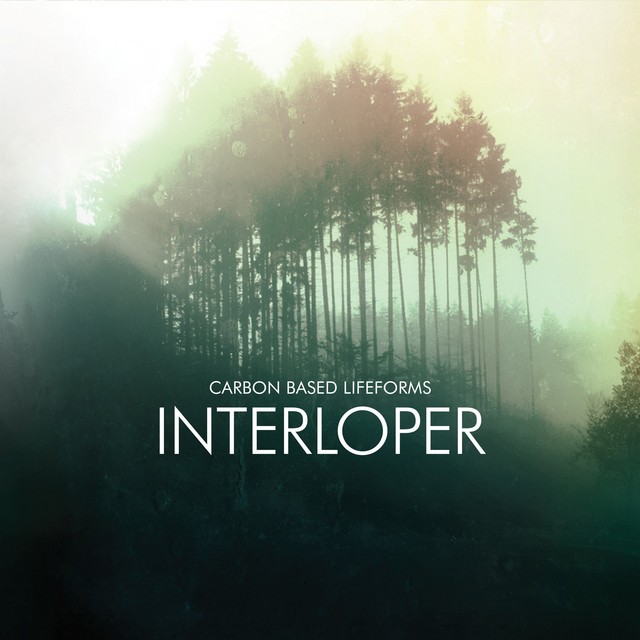

<!-- [)](error) error busqueda -->
<!-- [)]() -->
<!-- [)]() -->
<!-- [)](error) -->
<!-- [)]() -->

> Información del álbum facilitada por discogs.com:
>
> **Fecha de lanzamiento**: 2010
>
> **Géneros**: Electronic
>
> **Estilos**: Downtempo, Ambient, Acid
>
> **Pais:** US
>
> **Votos:** Media de 4.17 con 6 votos
>
> **Sello:** Omnium
>
> **Recorded At:** Water Music (2)
>
> **Drums** - Peter Irvine
>
> **Guitar** - Tom King (4)
>
> **Producer** - Dave Schramm
>
> **Recorded By** - Jon Rosenberg
>
> **Vocals, Bass, Banjo** - Tim Eriksen
>
> **Tracklist:**
>
> 24. Interloper
>     (feat. [Johannes Hedberg](https://www.discogs.com/artist/513100 "Swedish, electronic musician Johannes Hedberg was born...") & [Karin My Andersson](https://www.discogs.com/artist/693579)) 6:00
> 25. Right Where It Ends
>     (feat. [Anna Segerstad](https://www.discogs.com/artist/693580)) 6:49
> 26. Central Plain
>     (feat. [Karin My Andersson](https://www.discogs.com/artist/693579)) 7:12
> 27. Supersede 8:00
> 28. Init
>     (feat. [Anna Segerstad](https://www.discogs.com/artist/693580) & [Karin My Andersson](https://www.discogs.com/artist/693579)) 7:27
> 29. Euphotic
>     (feat. [Karin My Andersson](https://www.discogs.com/artist/693579)) 7:18
> 30. Frog
>     (feat. [Johannes Hedberg](https://www.discogs.com/artist/513100 "Swedish, electronic musician Johannes Hedberg was born...") & [Karin My Andersson](https://www.discogs.com/artist/693579)) 7:20
> 31. M
>     (feat. [Johannes Hedberg](https://www.discogs.com/artist/513100 "Swedish, electronic musician Johannes Hedberg was born...") & [Karin My Andersson](https://www.discogs.com/artist/693579)) 5:28
> 32. 20 Minutes 7:26
> 33. Polyrytmi
>     (feat. [Carl Michael Hedberg](https://www.discogs.com/artist/1806775)) 8:44
