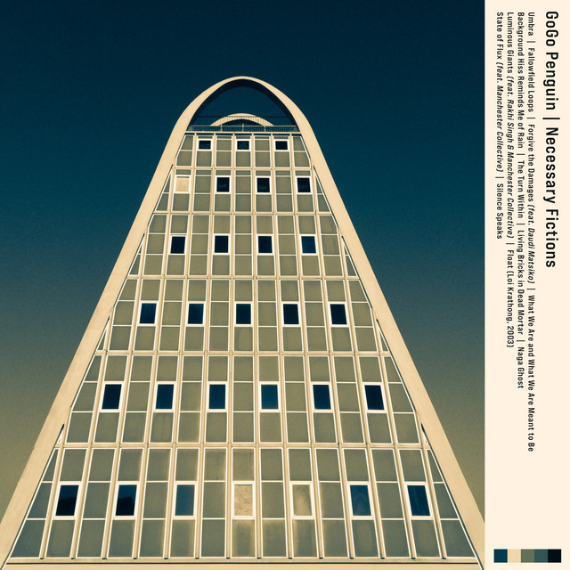

<!-- [)](error) error busqueda -->
<!-- [)]() -->
<!-- [)]() -->
<!-- [)](error) -->

> Información del álbum facilitada por discogs.com:
>
> **Fecha de lanzamiento**: 2025
>
> **Géneros**: Electronic, Jazz
>
> **Estilos**: Breakbeat
>
> **Pais:** France
>
> **Votos:** Media de 4.42 con 31 votos
>
> **Sello:** Virgin
>
> **Artwork** - Alex And Martin
>
> **Design** - Frank Loriou
>
> **Mastered By** - Nilesh Patel
>
> **Tracklist:**
>
> 1. Umbra 3:12
> 2. Fallowfield Loops 4:44
> 3. Forgive The Damages
>    (feat. [Daudi Matsiko](https://www.discogs.com/artist/4274107)) 4:10
> 4. What We Are And What We Are Meant To Be 5:37
> 5. Background Hiss Reminds Me Of Rain 1:40
> 6. The Turn Within 5:48
> 7. Living Bricks In Dead Mortar 2:52
> 8. Naga Ghost 5:24
> 9. Luminous Giants
>    (feat. [Manchester Collective](https://www.discogs.com/artist/10355359 "Chamber collective based in the North-West of...") & [Rakhi Singh](https://www.discogs.com/artist/1729415 "Violinist, collaborator, composer & music director based...")) 5:09
> 10. Float (Loi Krathong, 2003) 2:33
> 11. State Of Flux
>     (feat. [Manchester Collective](https://www.discogs.com/artist/10355359 "Chamber collective based in the North-West of...")) 4:28
> 12. Silence Speaks 3:09
