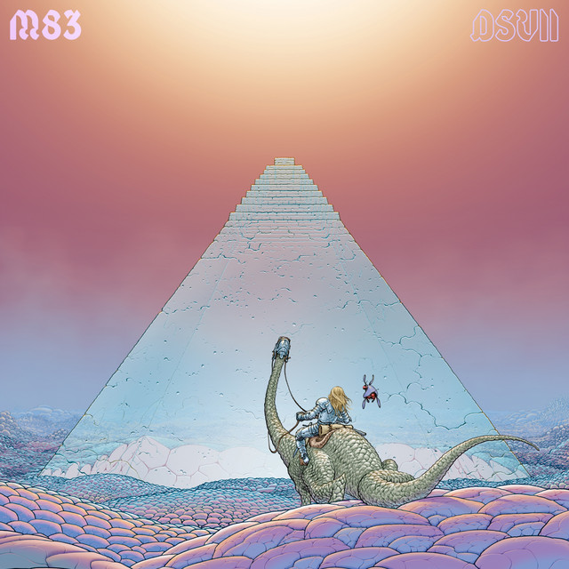

<!-- [)]() -->
<!-- [)]() -->

> Información del álbum facilitada por discogs.com:
>
> **Fecha de lanzamiento**: 2019
>
> **Géneros**: Electronic
>
> **Estilos**: Ambient, Electro
>
> **Pais:** US
>
> **Votos:** Media de 4.33 con 9 votos
>
> **Sello:** Channel One
>
> **Manufactured By:** Hit Bound Mfg Inc
>
> **Distributed By:** Hit Bound Mfg Inc
>
> **Recorded At:** Channel One Recording Studio
>
> **Remixed At:** Channel One Recording Studio
>
> **Mastered At:** K.K. Mastering
>
> **Bass** - Bertram "Ranchie" McLean
>
> **Bass, Guitar [Rhythm]** - Robbie Shakespeare
>
> **Composed By, Backing Vocals** - Fitzroy Simpson
>
> **Composed By, Vocals [Lead], Backing Vocals** - Donald Shaw (2)
>
> **Composed By, Vocals [Lead], Backing Vocals** - Lloyd Ferguson
>
> **Drums** - Carlton "Santa" Davis
>
> **Drums** - Sly Dunbar
>
> **Engineer** - Ernest Hookim
>
> **Engineer** - Lancelot "Maxie" McKenzie
>
> **Guitar [Lead]** - Earl "Chinna" Smith
>
> **Guitar [Lead]** - Radcliffe "Dougie" Bryan
>
> **Guitar [Rhythm]** - Tony Chin
>
> **Horns** - Don Drummond Jr.
>
> **Horns** - Herman Marquis
>
> **Horns** - Tommy McCook
>
> **Keyboards** - Ansel Collins
>
> **Keyboards** - Bernard "Touter" Harvey
>
> **Keyboards** - Ossie Hibbert
>
> **Percussion** - Barnabas
>
> **Percussion** - Noel "Scully" Simms
>
> **Percussion** - Uziah "Sticky" Thompson
>
> **Producer** - Jo Jo Hookim
>
> **Tracklist:**
>
> 1. Hell Riders 6:47
> 2. A Bit Of Sweetness 3:36
> 3. Goodbye Captain Lee 2:25
> 4. Colonies 4:37
> 5. Meet The Friends 3:02
> 6. Feelings 3:55
> 7. A Word Of Wisdom 1:42
> 8. Lune De Fiel 3:43
> 9. Jeux D'enfants 2:08
> 10. A Taste Of The Dusk 3:51
> 11. Lunar Son 2:45
> 12. Oh Yes You're There, Everyday 5:05
> 13. Mirage 2:46
> 14. Taifun Glory 3:14
> 15. Temple Of Sorrow 7:04
