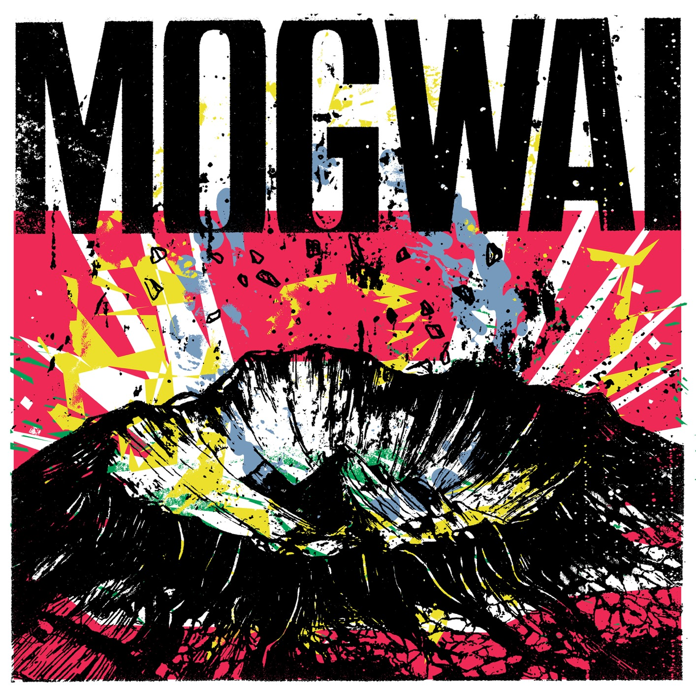

**Género:** Alternative

**Sello:** Rock Action Records

**Año:** 2025-01-24

**Total de pistas:** 10

## Tracklist

**1.** God Gets You Back _[6:40]_ | [📺](https://www.youtube.com/watch?v=hq30tXF-n5E)

**2.** Hi Chaos _[5:24]_ | [📺](https://www.youtube.com/watch?v=ADPB3SciZRo)

**3.** What Kind of Mix Is This? _[4:11]_ | [📺](https://www.youtube.com/watch?v=r-6-fFNlF4Y)

**4.** Fanzine Made of Flesh _[4:34]_ | [📺](https://www.youtube.com/watch?v=hKFvvSE4SCo)

**5.** Pale Vegan Hip Pain _[4:24]_ | [📺](https://www.youtube.com/watch?v=3PCHUBq0wMg)

**6.** If You Find This World Bad, You Should See Some of the Others _[7:22]_ | [📺](https://www.youtube.com/watch?v=cV1NGS4uOiw)

**7.** 18 Volcanoes _[6:18]_ | [📺](https://www.youtube.com/watch?v=91HSMqHukuo)

**8.** Hammer Room _[5:16]_ | [📺](https://www.youtube.com/watch?v=1IqGsrQiV4M)

**9.** Lion Rumpus _[3:33]_ | [📺](https://www.youtube.com/watch?v=msqM3QGU92A)

**10.** Fact Boy _[7:02]_ | [📺](https://www.youtube.com/watch?v=KOVNE2D7fmg)
