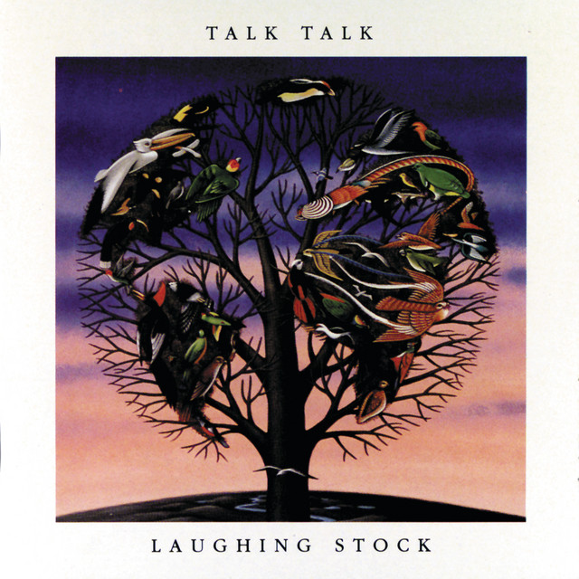

<!-- [)]() -->
<!-- [)]() -->

> Información del álbum facilitada por discogs.com:
>
> **Fecha de lanzamiento**: 1991
>
> **Géneros**: Rock
>
> **Estilos**: Post Rock, Experimental, Ambient
>
> **Tracklist:**
>
> A1. Myrrhman
>
> A2. Ascension Day
>
> A3. After The Flood
>
> B1. Taphead
>
> B2. New Grass
>
> B3. Runeii
