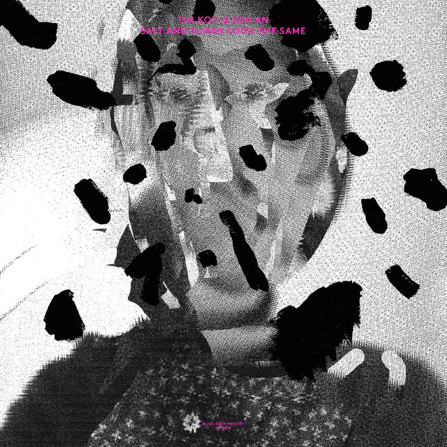

<!-- [)]() -->
<!-- [)]() -->
<!-- [)](error) -->
<!-- [)]() -->

> Información del álbum facilitada por discogs.com:
>
> **Fecha de lanzamiento**: 2024
>
> **Géneros**: Electronic
>
> **Estilos**: Abstract, Ambient, Sound Collage, Dream Pop
>
> **Pais:** Belgium
>
> **Votos:** Media de 3.6 con 5 votos
>
> **Sello:** Evil Penguin Records
>
> **Distributed By:** LC Music
>
> **Produced At:** Motor Music, Mechelen
>
> **Recorded At:** Motor Music, Mechelen
>
> **Mixed At:** Motor Music, Mechelen
>
> **Artwork [Website & Package]** - Fanny Morriën
>
> **Backing Vocals** - Jasmine Tomballe
>
> **Backing Vocals** - Jim Cole (4)
>
> **Backing Vocals** - Jyoti Singh
>
> **Backing Vocals** - Steve Kashala
>
> **Bass** - Griet Van Heddeghem
>
> **Bass** - Jim Cole (4)
>
> **Clavinet** - Hans Ijzerman
>
> **Drums** - Frank Vanweddingen
>
> **Drums** - Jordi Geuens
>
> **Drums** - Wouter Van Tornhout
>
> **Drums, Percussion** - Jonas Filtenborg
>
> **Electric Piano [Rhodes]** - Hans Ijzerman
>
> **Electric Piano [Wurlitzer]** - Yannic Fonderie
>
> **Engineer [Assistant]** - Arno Lievens
>
> **Engineer [Assistant]** - Gilles Monbailliu
>
> **Engineer [Assistant]** - Thomas De Pauw
>
> **Guitar** - Jim Cole (4)
>
> **Guitar [Riddles]** - Ben Adriaensen
>
> **Harpsichord** - Yannic Fonderie
>
> **Keyboards** - Jim Cole (4)
>
> **Keyboards [Solina]** - Yannic Fonderie
>
> **Lead Guitar** - Bruno Ravelingien
>
> **Mastered By** - Huub Reijnders
>
> **Mastered By** - Steven Maes
>
> **Mellotron** - Yannic Fonderie
>
> **Mixed By** - Huub Reijnders
>
> **Mixed By** - Jonas Filtenborg
>
> **Organ [Hammond]** - Hans Ijzerman
>
> **Percussion** - Jim Cole (4)
>
> **Percussion** - Jonas Filtenborg
>
> **Photography By** - Ellen Ongena
>
> **Photography By [Other Pictures]** - Hans Ijzerman
>
> **Photography By [Other Pictures]** - Jimmy Colman
>
> **Photography By [Other Pictures]** - Kalina Malehounova
>
> **Piano** - Hans Ijzerman
>
> **Producer, Recorded By** - Huub Reijnders
>
> **Producer, Recorded By** - Jonas Filtenborg
>
> **Programmed By** - Jim Cole (4)
>
> **Programmed By [Beat]** - Jim Cole (4)
>
> **Strings** - Jim Cole (4)
>
> **Synth** - Hans Ijzerman
>
> **Synthesizer [Ableton, Korg, Moog, Prophet]** - Yannic Fonderie
>
> **Synthesizer [Microkorg]** - Jim Cole (4)
>
> **Tambourine** - Yannic Fonderie
>
> **Triangle** - Yannic Fonderie
>
> **Vibraphone** - Jim Cole (4)
>
> **Vocals** - Jim Cole (4)
>
> **Tracklist:**
>
> A1. Bye Bye Betty
>
> A2. Moments Of Joy
>
> A3. Lemongrass Citronella
>
> A4. Can't Stand In The Past
>
> A5. Besafe Airtel
>
> A6. Today Only Happens Once
>
> A7. Incense Holder
>
> A8. Salt And Sugar Look The Same
>
> A9. A Lead Balloon
>
> B1. Sandalwood In The Summer
>
> B2. How They Made It
>
> B3. Somewhere In Time
>
> B4. Old Plates And Desirable Traits
>
> B5. Drawing To Relax And Pass The Time
>
> B6. The Maybes Are Endless
>
> B7. Yume-No-Yume
>
> B8. Twice
>
> B9. Expected To Fade
