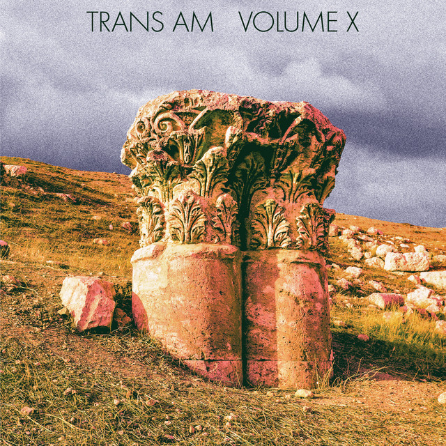

<!-- [)](error) error busqueda -->
<!-- [)]() -->
<!-- [)]() -->

> Información del álbum facilitada por discogs.com:
>
> **Fecha de lanzamiento**: 2014
>
> **Géneros**: Rock
>
> **Estilos**: Space Rock, Math Rock
>
> **Pais:** US
>
> **Votos:** Media de 4.17 con 6 votos
>
> **Sello:** Omnium
>
> **Recorded At:** Water Music (2)
>
> **Drums** - Peter Irvine
>
> **Guitar** - Tom King (4)
>
> **Producer** - Dave Schramm
>
> **Recorded By** - Jon Rosenberg
>
> **Vocals, Bass, Banjo** - Tim Eriksen
>
> **Tracklist:**
>
> 1. Anthropocene 5:43
> 2. Reevaluations 4:22
> 3. Night Shift 4:01
> 4. K Street 1:28
> 5. Backlash 2:37
> 6. Ice Fortress 3:56
> 7. Failure 2:14
> 8. I’ll Never 4:45
> 9. Megastorm 4:21
> 10. Insufficiently Breathless 4:48
